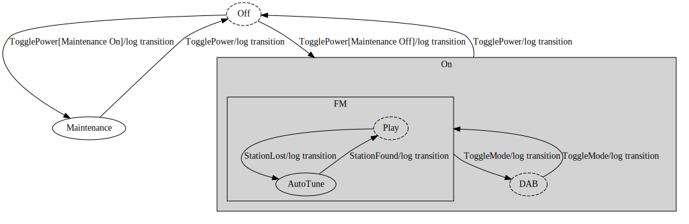

== fsm-bbv Finite State Machine

=== fsm-bbv States

[cols="2,2,3,1,1,1,3,3"]
|===
|Name |Context |Description |Final |Initial |Composite |Entry Action |Exit Action

|[[fsm-bbv-Root]]Root
|-
|
|true
|true
|true
|-
|-

|[[fsm-bbv-Off]]Off
|Root
|
|false
|true
|false
|Entry action of Off state
|ExitOffstate

|[[fsm-bbv-Maintenance]]Maintenance
|Root
|
|false
|false
|false
|
|

|[[fsm-bbv-On]]On
|Root
|
|false
|false
|true
|
|

|[[fsm-bbv-FM]]FM
|On
|
|false
|false
|true
|entryFM
|exitFM

|[[fsm-bbv-DAB]]DAB
|On
|
|false
|true
|false
|
|

|[[fsm-bbv-Play]]Play
|FM
|
|false
|true
|false
|entryPlay
|exitPlay

|[[fsm-bbv-AutoTune]]AutoTune
|FM
|
|false
|false
|false
|
|

|===

=== fsm-bbv Transitions

[cols="2,2,3,1,3,3"]
|===
|Start State |End State |Description |Local |Guard |Action

|<<fsm-bbv-Off,Off>>
|<<fsm-bbv-Maintenance,Maintenance>>
|Off -> TogglePower
|false
|Maintenance is On
|log transition Off to Maintenance

|<<fsm-bbv-Off,Off>>
|<<fsm-bbv-On,On>>
|Off -> On
|false
|Maintenance Off
|OfftoOn

|<<fsm-bbv-Maintenance,Maintenance>>
|<<fsm-bbv-Off,Off>>
|Maintenance -> Off
|false
|
|MaintainedtoOff

|<<fsm-bbv-On,On>>
|<<fsm-bbv-Off,Off>>
|TogglePower -> On
|false
|
|OntoOff

|<<fsm-bbv-FM,FM>>
|<<fsm-bbv-DAB,DAB>>
|FM -> DAB
|false
|
|FMtoDAB

|<<fsm-bbv-DAB,DAB>>
|<<fsm-bbv-DAB,DAB>>
|DAB -> DAB
|true
|
|

|<<fsm-bbv-DAB,DAB>>
|<<fsm-bbv-FM,FM>>
|DAB -> FM
|false
|
|DABtoFM

|<<fsm-bbv-Play,Play>>
|<<fsm-bbv-Play,Play>>
|Play -> Play
|true
|
|

|<<fsm-bbv-Play,Play>>
|<<fsm-bbv-AutoTune,AutoTune>>
|Play -> AutoTune
|false
|
|PlaytoAutoTune

|<<fsm-bbv-AutoTune,AutoTune>>
|<<fsm-bbv-Play,Play>>
|AutoTune -> Play
|false
|
|AutoTunetoPlay

|===

