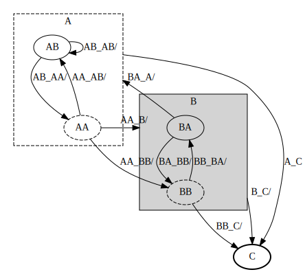

== fsm-builder Finite State Machine

=== fsm-builder States

[cols="2,2,3,1,1,1,3,3"]
|===
|Name |Context |Description |Final |Initial |Composite |Entry Action |Exit Action

|[[fsm-builder-Root]]Root
|-
|
|true
|true
|true
|-
|-

|[[fsm-builder-A]]A
|Root
|State A
|false
|true
|true
|-
|-

|[[fsm-builder-AA]]AA
|A
|State AA
|false
|true
|false
|-
|-

|[[fsm-builder-AB]]AB
|A
|State AB
|false
|false
|false
|-
|-

|[[fsm-builder-B]]B
|Root
|
|false
|false
|true
|-
|-

|[[fsm-builder-BA]]BA
|B
|State BA
|false
|false
|false
|-
|-

|[[fsm-builder-BB]]BB
|B
|State BB
|false
|true
|false
|-
|-

|[[fsm-builder-C]]C
|Root
|
|true
|false
|false
|-
|-

|===

=== fsm-builder Transitions

[cols="2,2,3,1,3,3"]
|===
|Start State |End State |Description |Local |Guard |Action

|<<fsm-builder-A,A>>
|<<fsm-builder-C,C>>
|A -> C when A_C
|false
|
|

|<<fsm-builder-AA,AA>>
|<<fsm-builder-AA,AA>>
|Local transition AA -> AA when (AA_AA)
|true
|
|

|<<fsm-builder-AA,AA>>
|<<fsm-builder-AB,AB>>
|AA -> AB when AA_AB
|false
|
|

|<<fsm-builder-AA,AA>>
|<<fsm-builder-B,B>>
|AA -> B when AA_B
|false
|
|

|<<fsm-builder-AA,AA>>
|<<fsm-builder-BB,BB>>
|AA -> BB when (AA_BB)
|false
|
|

|<<fsm-builder-AB,AB>>
|<<fsm-builder-AA,AA>>
|AB -> AA when AB_AA
|false
|
|

|<<fsm-builder-AB,AB>>
|<<fsm-builder-AB,AB>>
|AB -> AB when AB_AB
|false
|
|

|<<fsm-builder-B,B>>
|<<fsm-builder-C,C>>
|B -> C when B_C
|false
|
|

|<<fsm-builder-BA,BA>>
|<<fsm-builder-A,A>>
|BA -> A when BA_C
|false
|
|

|<<fsm-builder-BA,BA>>
|<<fsm-builder-BB,BB>>
|BA -> BB when BA_BB
|false
|
|

|<<fsm-builder-BB,BB>>
|<<fsm-builder-BB,BB>>
|Local transition BB -> BB when BB_BB
|true
|
|

|<<fsm-builder-BB,BB>>
|<<fsm-builder-BA,BA>>
|
|false
|
|VV -> BA when BB_BA

|<<fsm-builder-BB,BB>>
|<<fsm-builder-C,C>>
|BB -> C when BB_C
|false
|
|

|===

