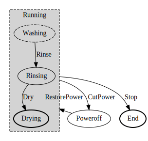

== fsm-washer Finite State Machine

=== fsm-washer States

[cols="2,2,3,1,1,1,3,3"]
|===
|Name |Context |Description |Final |Initial |Composite |Entry Action |Exit Action

|[[fsm-washer-Running]]Running
||Running State
|false
|true
|true
|-
|-

|[[fsm-washer-End]]End
||State End
|true
|false
|false
|-
|-

|[[fsm-washer-PowerOff]]PowerOff
||PowerOff State
|false
|false
|false
|-
|-

|===

=== fsm-washer Transitions

[cols="2,2,3,1,3,3"]
|===
|Start State |End State |Description |Local |Guard |Action

|<<fsm-washer-Running,Running>>
|<<fsm-washer-End,End>>
|Running -> End
|false
|
|

|<<fsm-washer-Running,Running>>
|<<fsm-washer-PowerOff,PowerOff>>
|Running -> PowerOff
|false
|
|

|<<fsm-washer-PowerOff,PowerOff>>
|<<fsm-washer-Running,Running>>
|PowerOff -> Running
|false
|
|

|===

