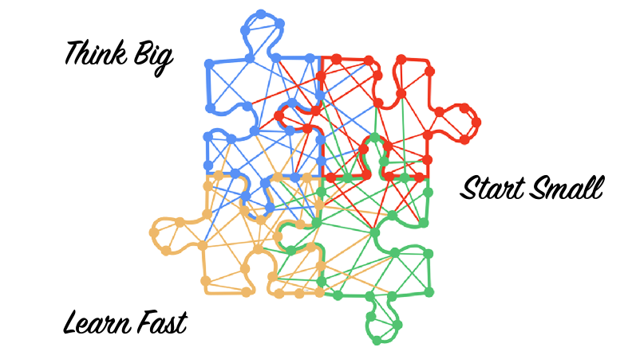

# Ambitious Missions need Disruptive Thinking

We are passionate **coaches** and **engineers**.
We are experts on **agile transformation**, **technical excellence**, and **agile product** development.
We support organizations with ambitious missions.

We promote the **digitalization** of the society and organization's processes.
We believe **innovation** and **technology** are a positive force of change for business and society.

We support our clients to increase their innovation and delivery processes through agile approaches and technical excellence.
We found out this mostly boils down to technical excellence, leadership, culture and organizational structure.

The most effective approaches so far to improve are **Lean** and **Agile** approaches.
We truly believe agile approaches are a huge improvement in the workplace and the competitiveness in the marketplace.
We promote

- [Software craftsmanship](https://manifesto.softwarecraftsmanship.org/) at the individual level,
- [Scrum](https://scrumguides.org/scrum-guide.html), sometimes Kanban or XP at the team level,
- [LeSS](https://less.works/less/framework) at the product and departmental level,
- Lean, [Beyond Budgeting](https://bbrt.org/), [Sociocracy](https://sociocracy30.org/) at the organization level,
- Our technical expertise is in domain-driven design _DDD_ and the modern Java stack.
